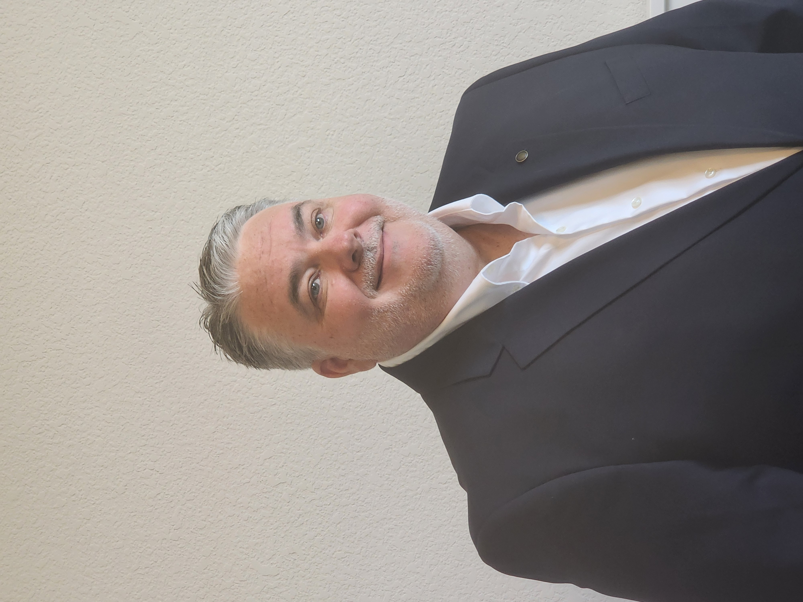

<meta name="description" content="Al Monteiro - Dallas TX (al.monteiro.tx@gmail.com) - Senior Technical Program Manager | Enterprise Agile Delivery Lead | Technology Transformation Leader | Enterprise Program Management | Portfolio & PMO Governance | Senior IT Project Manager | 15+ years in Enterprise Agile Delivery, Digital Transformation, CRM Modernization, BI Analytics, and Technology Transformation">
<meta name="keywords" content="Technical Program Manager, SAFe Program Consultant, IT Project Manager Dallas, CRM Modernization, Agile Delivery, BI Analytics, Verizon Business, CVS Caremark, Frontier Communications, Blue Cross Blue Shield, Toyota Connected North America, Dallas TX, Dallas Texas, Plano TX">

  
  
  <h1>Al Monteiro</h1>
  
<strong>Dallas, TX Metroplex</strong>

  
  

   ✉️ <a href="mailto:al.monteiro.tx@gmail.com">al.monteiro.tx@gmail.com</a> &nbsp;&nbsp; | &nbsp;&nbsp; 
    Open to Full-time or Contract
  

  

    🔗 <strong><a href="https://www.linkedin.com/in/al-monteiro-usa-tx-it-projectmanager9726933111">LinkedIn</a></strong> &nbsp;&nbsp; 
    🔗 <strong><a href="https://al-monteiro-tx.github.io/">GitHub</a></strong> &nbsp;&nbsp; 
    🔗 <strong><a href="https://profile.indeed.com/p/alm-d0wcjqr">Indeed</a></strong>
  

---

# SENIOR TECHNICAL PROGRAM MANAGER | ENTERPRISE AGILE DELIVERY LEAD | TECHNOLOGY TRANSFORMATION LEADER

**Enterprise Program Management | Portfolio & PMO Governance | Senior IT Project Manager**

**Digital Transformation | CRM Modernization | Order Management Systems | SaaS Integration | Data Migration /Conversion | BI & Analytics | Agile Delivery | Leading SAFe /Scrum**

---

## PROFESSIONAL SUMMARY

Enterprise IT Program Manager and Technical Program Management (TPM) leader with **15+ years** driving large-scale digital transformations, complex application modernizations, and cloud/SaaS integrations across telecommunications, healthcare, and financial services. Certified **SAFe Program Consultant** with proven expertise managing multi-million dollar portfolios ($11M+) and directing cross-functional, globally distributed teams spanning software engineering, enterprise architecture, infrastructure, DevOps, and data engineering.

Track record scaling Agile frameworks (SAFe, Scrum) and hybrid SDLC methodologies to enhance delivery predictability, strengthen executive visibility, and optimize release governance. Strategic technical delivery leader in CRM modernization (Lead-to-Quote, Lead-to-Cash workflows), BI analytics modernization, enterprise data migrations, and establishing scalable infrastructure for data-driven decision-making. Expertise in program increment planning, portfolio roadmapping, RAID risk management, stakeholder alignment, and executive reporting.

---

## CORE COMPETENCIES

**Delivery Frameworks & Methodologies**  
Scaled Agile (SAFe) Program Management, Scrum Master Certification, Agile Delivery Leadership, Waterfall Project Management, Hybrid SDLC, DevOps Pipeline Governance, CI/CD Automation, Production Release Management, Program Increment Planning, Sprint Execution

**Program & Portfolio Leadership**  
PMO Leadership & Governance, Strategic Enterprise Roadmapping, Multi-Year Technology Planning, Resource Capacity Planning, Portfolio Financials Management, Vendor Management, Executive Stakeholder Alignment, Cross-Functional Team Leadership, RAID Log Management (Risks, Assumptions, Issues, Dependencies), Risk Escalation, Delivery Predictability Optimization

**Enterprise Solutions & Platforms**  
CRM Modernization (Lead-to-Quote, Lead-to-Cash), Lead-to-Opportunity Workflows, SaaS Integration & Governance, Master Data Management (MDM) Frameworks, Data Governance & Compliance, ETL Pipeline Development, Enterprise Data Migration, Data Analytics Modernization, BI Analytics (Google Looker), Order Management Systems (OMS), ERP Systems, Business Support Systems (BSS)

**Technical & Software Tools**  
Jira Enterprise, Confluence, Rally Software, Microsoft Project, Visio, Microsoft 365, Google Workspace, SQL Query Development, ETL Tool Implementation, Data Integration Frameworks, MDM Platforms, Cloud Infrastructure (AWS, Google Cloud), DevOps Pipelines, CI/CD Platforms, Portfolio Management Systems, API Integration, Agile Reporting & Dashboards

---

## EDUCATION & PROFESSIONAL CERTIFICATIONS

- **Master of Business Administration (MBA)** – Marketing, Minor in Finance  
  *LeTourneau University, Dallas, TX*

- **Bachelor of Business Administration (BBA)**  
  *LeTourneau University, Dallas, TX*

- **Scaled Agile Framework - SAFe Certified Agilist** – Scaled Agile, Inc.
- **Certified Scrum Master (CSM)** – Scrum Alliance

---

## PROFESSIONAL EXPERIENCE

### VERGE INFORMATION TECHNOLOGY | Remote, US  
**Technical Project Manager, BI & Analytics Transformation** | Oct 2025 – Feb 2026
- Directed Business Intelligence modernization and data analytics transformation initiative for **$2M** Verizon Business marketing pre-MVP program, centralizing performance data across enterprise to build scalable foundation for AI-driven ROI insights and revenue optimization
- Governed data solutions roadmap through proof-of-concept (POC) and near-MVP milestones, managing ingestion, storage, integration, curation, and reporting infrastructure; coordinated cross-functional delivery activities to resolve dependencies and mitigate risks
- Led **Master Data Management (MDM)** strategy and data governance framework initiatives to ensure data consistency, accessibility, and regulatory compliance across multiple business units; established data quality standards and management protocols
- Coordinated technical platform migration from legacy **Tableau** analytics to **Google Looker** analytics platform; aligned analytics infrastructure with CRM Lead-to-Opportunity business data workflows to enhance decision-making
- Orchestrated cross-functional Agile delivery ceremonies and stakeholder communication; resolved complex cross-team dependencies between business, engineering, and data teams to maintain delivery momentum

### AKKODIS | Remote, US  
**Technical Delivery Manager, Technical Program Management** | Feb 2025 – Sep 2025
- Oversaw delivery stages and execution milestones of infrastructure, SaaS, and enterprise application initiatives; drove execution consistency across business and technology organizations through structured governance and process discipline
- Synthesized PMO governance practices and program management methodologies that improved executive stakeholder visibility into program milestones, resource constraints, capacity planning, and delivery risks; enhanced decision-making through comprehensive reporting
- Managed full program lifecycle from initiation through closure, partnering with engineering leads, third-party vendors, change management teams, and business executives to align technical delivery with operational priorities and business objectives
- Negotiated technology roadmap planning, release readiness validation, and process improvements to enhance delivery predictability and operational transparency; established KPI tracking and quality assurance metrics

### NOBLESOFT SOLUTIONS | Remote, US  
**Agile Delivery Manager / Senior Scrum Master, Technical Program Delivery** | Aug 2023 – Sep 2024
- Directed Agile delivery execution for Blue Cross Blue Shield (BCBS) Florida CRM and Pega Quote-to-Order transformation initiatives; managed distributed onshore and offshore engineering squads through structured program management and sprint execution
- Managed cross-functional delivery mechanics including resource planning, KPI tracking, financial monitoring, and budget oversight across complex enterprise programs utilizing Agile and hybrid delivery methodologies
- Federated Scaled Agile ceremonies including Program Increment (PI) Planning, Scrum of Scrums, backlog refinement, and release coordination; aligned program execution with cross-organizational strategic initiatives and business objectives
- Standardized cross-functional program health reporting and RAID logs across complex portfolios; provided executive stakeholders with critical risk insights and mitigation strategies needed to maximize on-time technical delivery

### VERIZON BUSINESS | Irving, TX  
**Technical Delivery Manager, Enterprise Portfolios & Technology Transformation** | Jun 2019 – Jun 2023
- Spearheaded enterprise-wide technology transformation initiatives spanning CRM system modernization, DevOps pipeline governance, security compliance, and Business Intelligence analytics; collaborated with executive leadership on portfolio investment priorities and strategic direction
- Led development and implementation of custom corporate portfolio management (CPM) framework and platform to integrate internal systems with SaaS-based solutions; improved portfolio visibility and governance across all enterprise initiatives
- Architected and deployed internal enterprise initiatives delivery intelligence platform leveraging APIs and automated ETL pipelines; consolidated PMO financials, quality metrics, and operational performance data into executive dashboards, providing program intake-to-completion transparency
- Managed strategic planning, multi-year technology roadmapping, and portfolio investment prioritization for enterprise division; aligned business support systems (BSS) and customer-facing systems with long-term corporate strategic goals
- Governed DevOps release readiness and supervised CI/CD automation, security compliance validation, and multi-team production deployment rollouts; ensured adherence to enterprise change management protocols
- Audited and secured multi-million-dollar R&D Tax Credit returns; partnered with Corporate Finance to capitalize on high-visibility division incentives

### CREOSPAN | Irving, TX  
**Senior IT Project Manager, Enterprise Program Management** | Oct 2017 – May 2019
- Led multi-tier Lead-to-Order and Lead-to-Cash digital transformation initiatives for Verizon Business; integrated CRM data ecosystems to scale commercial growth and monetize actionable operational sales insights
- Structured and facilitated hybrid Agile-Waterfall delivery frameworks including Program Increment (PI) Planning, release management cycles, and Scrum of Scrums coordination across highly matrixed, distributed vendor and internal engineering teams
- Bridged executive strategic planning with engineering execution; managed complex technical dependencies, RAID logs, and budget tracking using enterprise tools (Jira, Confluence) to ensure alignment and transparency
- Established governance frameworks supporting release management, production readiness, and deployment protocols across complex technical integrations

### CB CONSULTING | Lewisville, TX  
**Senior IT Project Manager** | May 2016 – Oct 2016
- Managed **$1.1M** telematics registration modernization program for Toyota Connected North America client; navigated complex vendor ecosystem using hybrid Agile-Waterfall delivery model
- Coordinated internal teams and external vendors while establishing governance frameworks supporting release management, production readiness, and deployment protocols
- Aligned Agile sprint execution with Waterfall release milestones; ensured vendor SOW-aligned delivery execution across all release cycles

### CONSULTING NETWORK GROUP | Richardson, TX  
**Senior IT Project Manager, Data Migration & Divestiture Lead** | Jun 2015 – Mar 2016
- Co-directed enterprise data migration and conversion strategy for Verizon to Frontier Communications multi-state divestiture; successfully transitioned critical wholesale telecom Order-to-Bill workflows while maintaining business continuity
- Managed extraction, transformation, validation, and safe migration of **~1.5M** wholesale broadband records; preserved data quality and regulatory compliance against strict Master Data Management (MDM) frameworks and telecom industry standards
- Managed end-to-end program lifecycle governing project budgeting, ETL pipeline development, SQL data validations, comprehensive data mapping matrices, mock run execution, and executive milestone reporting

### CVS CAREMARK | Richardson, TX  
**Senior Technical Project Manager, Advisor** | Sep 2013 – Jun 2015
- Directed **$4M** enterprise integration initiative mapping Blue Cross Blue Shield (BCBS) Texas health plan data into Caremark PBM core systems to support scalable benefit administration and operational service delivery
- Orchestrated cross-functional team execution of CRM system modernizations, secure enterprise data migrations, and third-party SaaS platform rollouts under time-sensitive healthcare regulatory compliance frameworks
- Partnered with PMO leadership to define strict delivery governance frameworks, risk escalation protocols, and executive transparency dashboards; significantly improved delivery predictability and stakeholder confidence

---

*Open to full-time and contract opportunities in the Dallas/Fort Worth Metroplex and remote roles.*  

**Last updated: June 2026**
